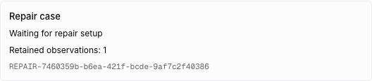
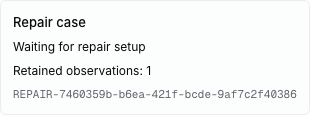

# Independent Admin observation, supervision and investigation

The current LoopWork baseline routes role-requested `agent-fault` interventions to
independent Admin management. The source implementation is
`repair-observation-bridge.ts`, `admin-management-store.ts` and
`admin-controller.ts`; the old assistance loop excludes these faults.

## Implemented boundary

The target now has an independent management database at
`<engineering-database>.admin.sqlite`, an Admin-only worker mode and a separate
Go worker client/mutex. Management RPC does not initialize the business database;
each database rejects the other's schema. The Admin database has its own version,
WAL storage and full SQLite synchronization.

A new terminal request freezes the SHA-256 of the actual bundled protocol worker
and the running API executable. These are original runtime facts, rather than the
current checkout HEAD. The immutable original checkpoint and receipt remain in
business storage. Older receipts without these facts are not silently assigned
a newer runtime version and cannot enter this bridge until explicitly reconciled.

The Go bridge reads pending immutable observations, validates their native
workspace/issue/task/agent identity, and sends the original evidence and runtime
versions to management. The native source claim remains in the evidence; a later
claim timestamp does not rewrite the original failure. Closed/Done native issues
are not newly admitted by this increment.

Management persists an observation and its Case in one transaction. A stable
observation ID cannot be reused with changed evidence. Work-item cohort identity
uses the native workspace, issue and chain, retaining different signatures as
separate observations inside one Case. Original summary/version remain unchanged.
An Admin-origin fault must reference an existing Case in the same workspace;
it cannot recursively create an Admin for itself.

Only after management returns the exact Case/cohort does Go acknowledge delivery
against the original business observation ID and checkpoint fingerprint. A separate
business delivery record preserves the terminal receipt unchanged. A crash between
the two stores replays the same observation and reuses the same Case. A second
acknowledgement cannot rebind it. Delivery acknowledgement never resumes the
surrendered issue, spends a rework budget or grants Done.

## Supervision

Managed engineering startup launches `multica engineering admin-host` as a separate
process, outside the API and ordinary native agent slots. `make up`, `make status`
and `make down` own it as the `admin` component. The API only reads issue-scoped
management projections. The host acquires a 30-second owner/token lease and renews
every 10 seconds. Observation discovery and execution polling run independently,
so a blocked business read cannot starve either supervision or investigation.
A concurrent host cannot acquire an unexpired foreign lease. Expired ownership
advances the token; stale commands cannot modify the new owner's state.

The initial intent remains `stopped`, with no provider configured. Starting the
host does not discover executables, inspect model accounts or start a provider.
Investigation requires an explicit absolute executable, a runtime revision and a
durable start intent. Only the Codex protocol has the pre-prompt process binding
needed by this increment; macOS and Linux process identities are implemented.
Only the macOS fixture path has been executed in this checkout.

## Local operator commands

Run these from the checkout through its managed environment. They use local OS
access to the management worker, without a network management endpoint or a human
API token. `--provider-path` must name the executable chosen by the operator;
configuration alone does not execute it.

```sh
make env-exec ARGS="-- server/bin/multica engineering admin-control status"
make env-exec ARGS="-- server/bin/multica engineering admin-control configure --expected-revision 0 --provider-path /absolute/path/chosen-by-operator"
make env-exec ARGS="-- server/bin/multica engineering admin-control start --request-id operator-start-1"
make env-exec ARGS="-- server/bin/multica engineering admin-control stop --request-id operator-stop-1"
```

The example path is deliberately not a discovered/default provider. Do not start
a real model during migration acceptance without explicit authorization. Runtime
configuration can change only while stopped and after the previous allocation has
confirmed physical exit. Each new start/stop request increments the intent
revision; retrying the exact request ID reuses its receipt. A stop receipt confirms
the desired intent, not physical cleanup: read `status` until `active` is empty.
A native task or an investigation invocation cannot use these management commands.

## Investigation and physical ownership

The management database schema is version 4. It freezes one invocation generation,
session identity, runtime revision and recovery method per allocation. A durable
fair queue rotates Cases, with at most one live investigation process globally.
There is no fallback executable discovery or unconfigured alternate runtime.
Failures continue repair; an attempt count alone never creates a human question.

The SDK binds the actual PID, process group and birth marker before initialization
or prompt delivery. Rejected bindings stop the owned process tree. Stop, lost
supervision or changed intent cancels the invocation; the host retains an uncertain
allocation until physical exit is confirmed. A successor checks the saved process
identity before signalling it. A missing identity is held for reconciliation,
rather than interpreted as a stopped process. Only the same live owner can retire
a launch it knows never spawned or whose owned process exited before binding.
Shutdown does not explicitly release supervision when exit remains unconfirmed.

Each invocation gets a private working directory, log and Unix command socket.
Go retains the opaque command credential and projects the exact Case, generation,
session and supervision identity into the worker. The provider does not inherit
business database or Multica API credentials. This is a local trusted-operator
boundary, not an OS sandbox for a hostile same-user process.

The investigation commands are `engineering admin status`, `history`, `evidence`
and `submit`. Status must be read before evidence or submission. Bounded previews
include row hashes and lengths; history reads pin an exact row hash. Evidence keys
and terminal submissions are immutable. JSON files must be UTF-8 inside the
invocation's private `TMPDIR`; ordinary final text or a successful process exit
cannot substitute for a structured submission.

This increment accepts `deferred` investigation results and retains the failed
attempt and original observations while requeueing the Case. Verification and
diagnosis requests require scoped workspace takeover, and external waits require
independent diagnosis; these are explicitly rejected while their prerequisites
remain unconnected. No investigation receipt closes the Case or resumes business.

## Native visibility

The existing authenticated engineering overview looks up repair status only for
its native workspace/issue. The shared Web/Desktop panel shows the recorded Case,
retained-observation count and waiting-for-setup state. Management unavailability
leaves the original intervention readable and reports repair status as unavailable.
No task credential receives management supervision authority or a management RPC
endpoint. Runtime configuration and start/stop currently use the local CLI; shared
Web/Desktop execution controls are not yet connected. Original investigation evidence remains available on the issue.

## Verification boundary

Store tests cover separate-database rejection, immutable ID replay, cohort retention,
restart, workspace isolation, Admin self-fault linkage and expired supervisor tokens.
The two-store fixture interrupts delivery before acknowledgement and proves replay
without duplicate Case creation or business advancement. A bundled-worker fixture
checks management-only initialization and rejects reversing database roles.
Schema-upgrade checks retain existing observations and keep execution stopped.

Fake-provider integration runs the real SDK process lifecycle and bundled worker,
asserting PID binding before the first command, private status/evidence/submit,
retained deferred results, cooperative user stop and confirmed group exit. Separate
checks refuse a wrong birth marker and unknown allocation identity; CLI checks
keep human credentials out of the invocation protocol. Race-enabled checks passed. The complete protocol kernel passed 257 tests across
24 files; the PostgreSQL-backed engineering handler checks, kernel typecheck/lint,
Go vet and environment registry checks also passed. Linux cross-compilation passed;
no Linux process was executed.

Go tests cover native source validation, interrupted acknowledgement, exact runtime
version projection, unavailable management reads and heartbeat progress while
business discovery is blocked. All investigator processes in these checks are test-created fixtures with isolated homes. No installed model executable or account is resolved.

Both controlled native browser scenarios passed against the independent host in 50.5 seconds. Direct and
verification requests reached one acknowledged management Case with exact worker
and API executable fingerprints. The shared UI displayed the retained Case at
1280 and 390 pixels, while ordinary continuation and Done stayed blocked. These
runs used fixture-native tasks and no provider process. Teardown checks confirm
that their Cases, observations, attempts and scheduling records are removed.






[Native execution ownership](process-ownership.md) now records preparation-to-cleanup
controllers, original issue/chat scope, Codex birth/exit facts and project admission
guards in PostgreSQL as prerequisites for takeover. Admin draining-fence acquisition and native task cancellation are connected; physical writer draining and owned repair access remain incomplete.
Scoped workspace takeover, repair workspace/build actions, independent diagnosis,
repair verification, external dependency probes, verified business handoff and
runtime updates remain unconnected. Real-provider, Linux runtime and packaged
acceptance remain unverified. The complete migration stays active.


### Workspace takeover requests

An investigation that has read `engineering admin status` can request
`engineering admin workspace-takeover --observation-id <id> --reason <reason>`.
The ID must identify an original business observation from its own Case. The
management database (schema 3) saves one immutable request per invocation;
repeated identical commands return that request, while changed reasons or
observations are rejected. Runtime credentials cannot supply project IDs,
workspace paths, host authority, or a replacement source claim.

The independent host reconciles pending requests using the private business
`repair-source` action, then checks the native issue lifecycle, exact task
dispatch timestamp, Agent/runtime association, and local project directory
mapping. It persists the result as `source-inspected`, retaining the original
code/runtime versions and both registered and execution paths. `status` includes
this record. Settlement rechecks the live management lease, intent, session and
Case generation; stopped or replaced attempts cannot write a result.

Inspection does not acquire the project fence, cancel a native task, confirm
physical cleanup, validate the currently installed API/kernel version, or grant
write authority. These facts must be freshly checked by the acquiring
coordinator. Physical draining, repair
and independent verification remain incomplete; investigation may still submit
only deferred results.


### Private native cancellation bridge

The API owns `<engineering database>.control.sock` and a private credential file;
both have mode 0600. The independent Admin host reads the credential in Go and
never projects it into the worker or provider environment. The bridge has no TCP
route and constructs no separate TaskService or event bus.

For an inspected, live invocation the host calls the bridge with only its claim.
The API re-reads management authority/intent/session, the original business
checkpoint and the native source task dispatch/runtime. It requires a committed
project fence matching Case, attempt, generation, supervision token,
intent revision, original observation/hash/claim and registered repository.
It acquires the project row for update, revalidates the source and management identity, creates the draining fence, and commits before cancellation. An existing fence must match the same owner/source; later-generation handover additionally requires the management store to confirm the predecessor invocation physically exited.

The API persists its versioned writer inventory before cancelling active issue
and chat tasks through `CancelTaskWithReason`. It rechecks authority and source
before and after cancellation and physical operations. Token revocation and
daemon notification stay in the native service. It can stop recorded local
Codex groups with exact host/birth identity, and never signals the shared daemon.

Provider exit cannot replace a final cleanup receipt. Unknown legacy tasks,
missing identities, unsupported writers, contradictory zero-PID receipts or an
absent registered directory keep the fence draining. Only a fully accounted
cohort and native cleanup proof can produce `owned`; this denotes project
resource quiescence and does not grant repair writes or verified repair.
See [native physical ownership](process-ownership.md) for the acceptance boundary.


### Draining-fence acquisition and source authority

The private API reads `takeover-current` and the acknowledged original
`repair-source`; caller input remains only the invocation claim. It matches the
original receipt, snapshot, code version, API/kernel fingerprints, execution path
and mode against the saved inspection. The source worker validates the original
checkpoint; the API additionally checks its revision, exact native dispatch,
issue lifecycle and project/runtime mapping. Original runtime fingerprints are
provenance, not claims that the installed binaries have that same version.

After taking the project's update lock, the API repeats the authority/source
read and requires an unchanged acquisition tuple. It stores the original source
revision and hash in the fence. It commits before invoking native cancellation
and revalidates immediately after commit, before each cancellation, and after
the cancellation pass. If a later check fails, the committed fence remains;
logical status changes cannot release it.

Retries by the exact same owner reuse the fence. A newer generation may replace
only a lower-generation fence from the same Case and unchanged original source.
Management must confirm the previous invocation reached a physically settled
terminal state; unknown/live predecessors and other Cases are rejected. The
original source fields remain unchanged during handover. Initial acquisition and
owner handover enter `draining`; only physical reconciliation can establish
`owned`. Replaying the same owned source is idempotent and still does not
authorize repair writes.

### Durable physical progress

The separate `admin_takeover_progress` table records private API receipts per
invocation. `engineering admin status` exposes `takeoverProgress` with phase,
unfinished/unknown counts, inventory hash and the registered anchor when owned.
The agent cannot manufacture this receipt through its command surface. Management
accepts it only for the current acknowledged source and live invocation; revoked
claims cannot update progress, and successor generations start without inheriting
a stale permission. Schema upgrades from earlier management stores preserve
Cases and original observations without starting execution. Investigation
remains read-only; an owned progress receipt cannot close or resume business.

After an owned receipt, the host reads the registered repository's current
`workspace-content-v1:<HEAD>:<digest>` identity and revalidates the original
checkpoint, native source, live management claim and exact writer cohort before
persisting `workspace_version`. It retains the original failure's `code_version`
separately. This is a current content reading, not an immutable repair candidate,
running-service version, repair write capability or independent verification.
Failed reads leave physical progress with a null content version; older progress
without this field also reads as null. Each new reconciliation re-reads content
instead of reusing an earlier hash. See [content identity](process-ownership.md#repair-content-identity)
for the file coverage and remaining acceptance boundary.
